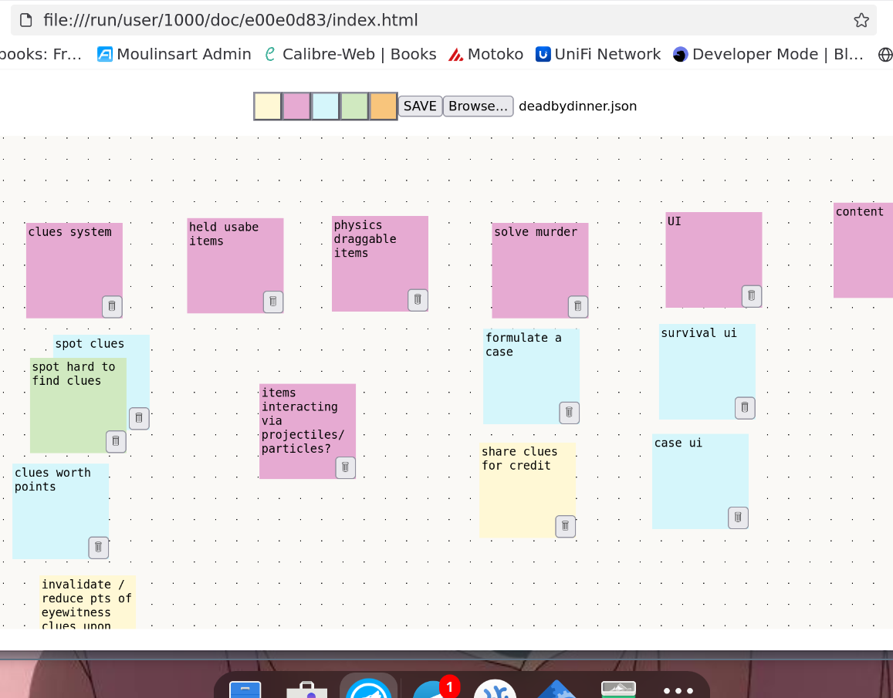

# STICKERZ

single html sticky notes

## use
1. open index.html in a web browser
1. add sticky notes with the colour buttons
1. write text in the sticky note
1. drag it around with the mouse
1. save it with the save button
1. load an already saved note space by browsing for it
1. don't lose your work on miro

## build
it's a simple sveltekit app so really all you gotta do is clone and npm install.

__a bug in svelte kit:__ as of 2025-11-12, you'll get more than just the index.html in the build folder, but they never get used... so you can safely ignore them. small comfort if you don't know that and think there's something wrong. but now you know and can relax with a nice cup of chai tea.